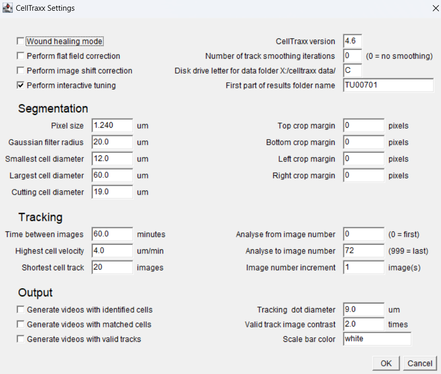
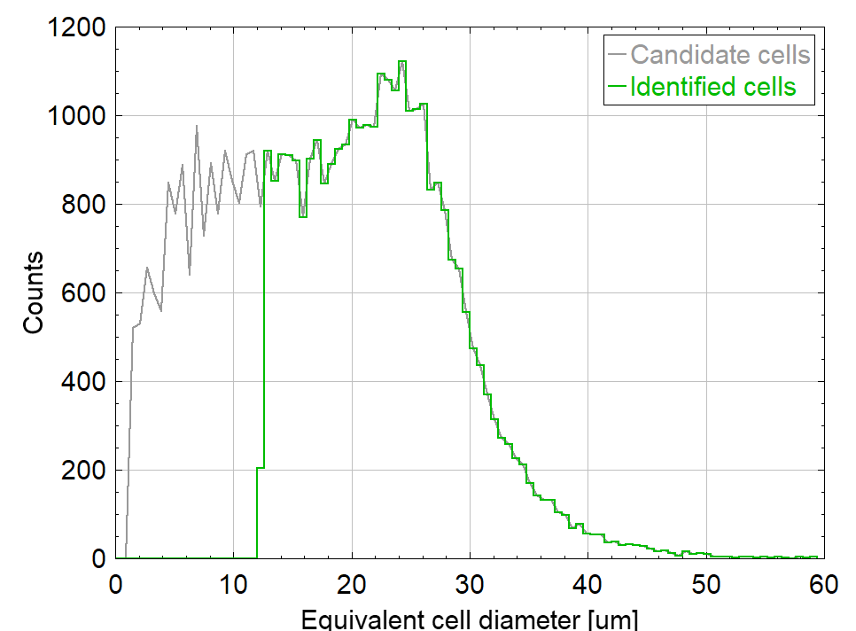
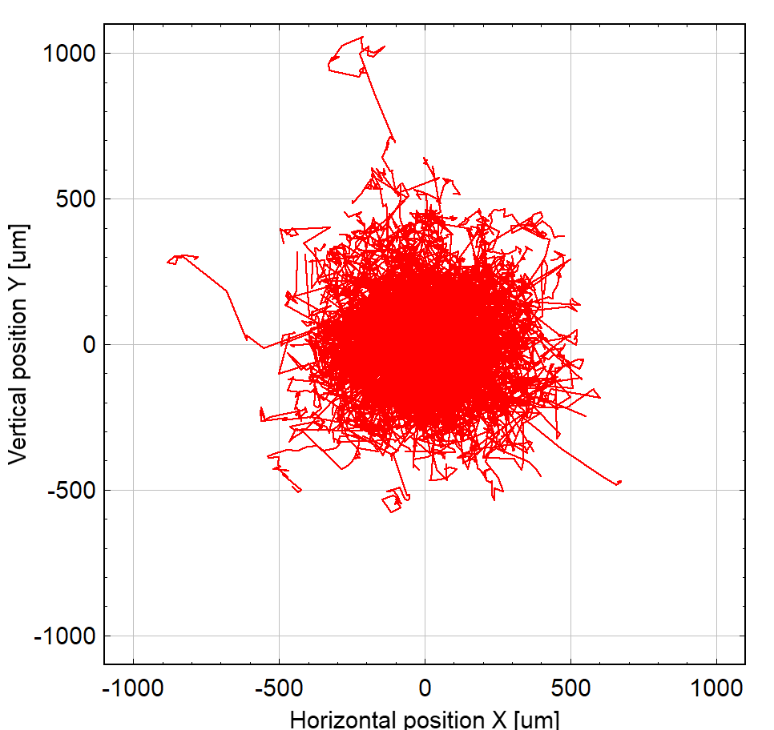
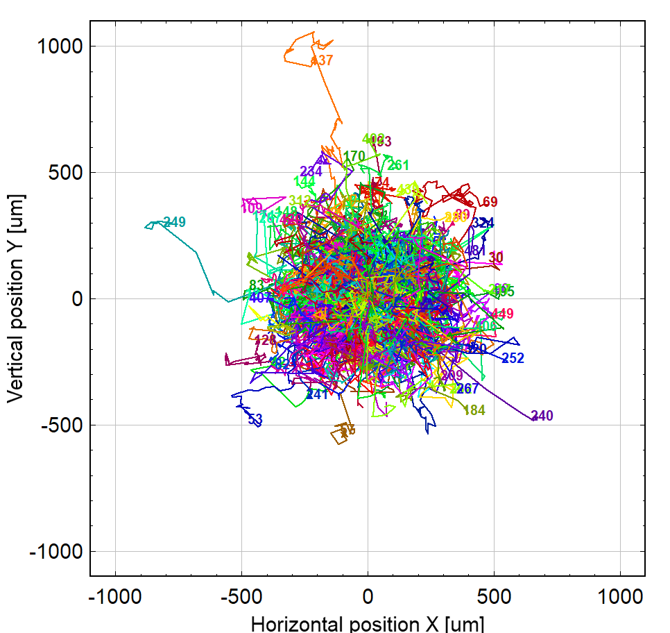
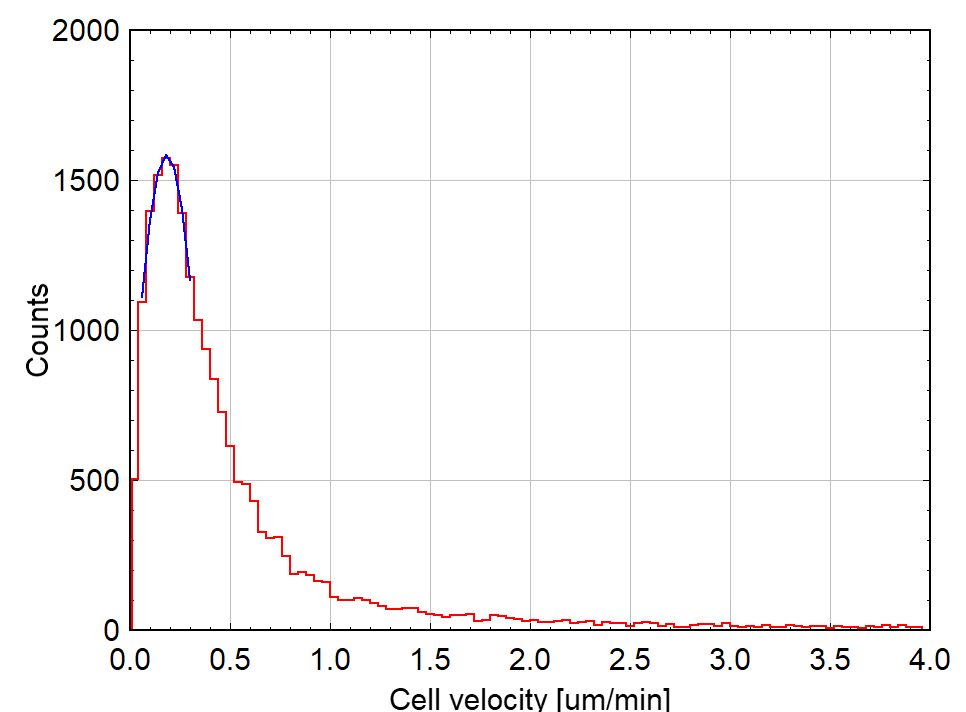
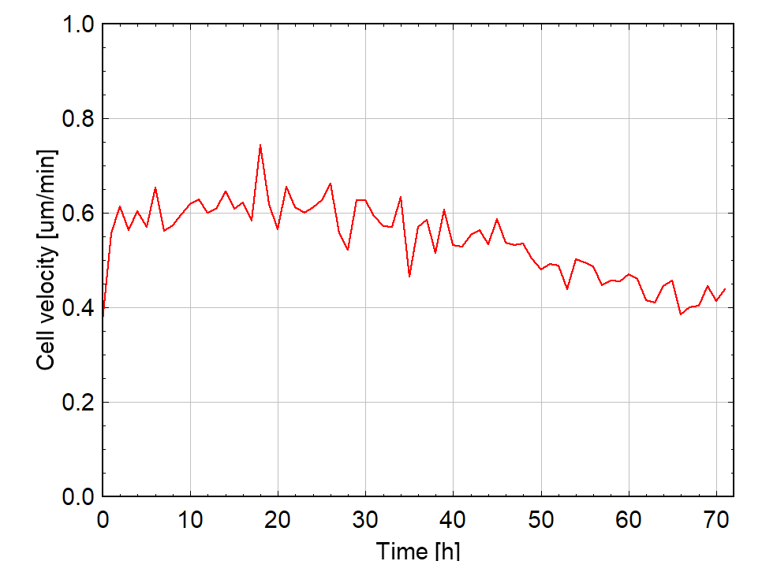

Updated June 23, 2025

# Image Analysis Pipeline Documentation for Incucyte S3 exported images and cell culture experiments

## Overview
This markdown file breaks down each image analysis step, from exporting raw files from the IncuCyte S3 to the final phenotype outputs like proliferation, morphology and motility. Please reach out via email or GitHub with any issues—I'm happy to help!

## Prerequisites
- Software: Python 3.x, Fiji (ImageJ), R 4.x, etc.
- Packages: numpy, pandas, cellpose
- Storage: Virtual/compute cluster for saving large data files

# Step 1: Metadata for each experiment plate
Make sure to always have the metadata file updated with a new experiment plate. 

This file should look somewhat like this with the following column format with example treatments:

| experiment_name | plate_type | coating | cell_type | drug_treatment | concentration | concentration_unit | interval_time | interval_time_unit | well_row | well_column |
| --------------- | ---------- | ------- | --------- | -------------- | ------------- | ------------------ | ------------- | ------------------ | -------- | ----------- |
| TU00701 | corning_96well_353219 | rattail1_collagen_354236 | tumor_epithelial | Media | 0 | uM | 1 | h | A | 1 |
| TU00701 | corning_96well_353219 | rattail1_collagen_354236 | tumor_epithelial | Capivasertib | 0.5 | uM | 1 | h | B | 7 |

Column 1: **experiment_name**

Each experiment is named by the first to letters for the treated cell type. In this case, "TU" stands for tumor cells. For macrophages, it would be 'MA'; for fibroblasts, 'FI', and so on.

Column 2: **plate_type**

Name format: [brand or manufacturing company]_[number of wells]wells_[category number]

This name format facilitates the search for the plate product page.

Column 3: **coating**

Name format: [tissue type]_[protein]_[category number]

This name format facilitates the search for the coating product page.

Column 4: **cell_type**

Because we worked we three cell types, these are the abbreviations for possible future experiments:

macrophage

fibroblast

tumor_epithelial

bulk - Bulk means all three cell types were cultured in the same experiment

Column 5: **drug_treatment**

Here I specified the drug used per well. For future experiments involving ligands or drug and ligand combinations, an extra column can be added called ligand_treatment. You would leave this column blank if no ligands were used, the drug_treatment column blank if no drugs were used or fill both columns for combination treatments. The following were the drugs used:

Media - The untreated/control wells; FluoBrite DMEM + 10% FBS + 1x glutamax

Capivasertib (10mM)

Selumetinib (10mM)

Paclitaxel (4mg/mL)

Olaparib (5mg/mL)

Column 6: **concentration** and Column 7: **concentration unit**

The concentration used for dosing the well.Separate column for concentration units for preprocessing and plotting purposes.

Column 8: **interval_time** and Column 9: **interval_time_unit**

The interval times for the experiments whether it's an hour or 30 minutes, always specify the units for later downstream analysis.

Column 10: **well_row** and Column 11: **well_column**

Here is where a plate map is more specific. For **well_row**, you input the letter from that row and for **well_column** the number from that column specific to the treatment. This will largely depend on the plate you're using so for example, for a 96-well plate the well_row letters go from A to H and the well_column numbers from 1 to 12 whereas a 24 well plate they go from A to D and 1 to 6.

# Step 2: Exporting the raw data

Always export as .tif files. You also don't have to wait until the scanning is over to export. To expediate the process, I would export all the image files for 10-12 hour intervals and leave it running on a virtual desktop while I worked.

# Step 3: Sorting

**Script path**: [updated_scripts/sorting.py](updated_scripts/sorting.py)

**How to run**: Preferably in a conda environment through command line or a jupyter notebook. I personally like to use VS code to run stuff locally. 

**Running time**: Couple of hours, much less if it's run as you export

1. You can change the paths from the following code snippet but keep the `{experiment_plate}` part consistent.

```{python eval=FALSE}
def sort_exported_incucyte_images(experiment_plate):
    raw_folder = f'/path/to/your/folder/{experiment_plate}'
    output_folder = f'/path/to/your/folder/{experiment_plate}_data/sorted_{experiment_plate}'

    os.makedirs(output_folder, exist_ok=True)
```

2. Example function run:

```{python eval=FALSE}
sort_exported_incucyte_images(experiment_plate="TU00701")
```

The function `sort_exported_incucyte_images` should work by inputting the experiment name into the function and it will conduct the following:
- Find the raw folder for exported image files from the Incucyte
- Create a new directory through output_folder called {experiment_plate}_data
- Create a new folder called sorted_{experiment_plate} depending on the name of the experiment plate (Ex. sorted_TU00701)
- Using the image file names, it will create a folder using the well row (or letter) first, the well column (or number) and the ROI number, and move the image file into that folder (Ex. A1_1).

By the end of this script, for example, all the image files corresponding to the well row A, well column 1 and ROI 1 will be in the folder A1_1 under sorted_TU00701, and so on.

# Step 4: Stabilizing

Adapted from a script created by the Heiser lab.

**Macro Script path**: [updated_scripts/stabilize.ijm](updated_scripts/stabilize.ijm)

**How to run**: Highly recommend using a virtual desktop for this step. You need to have [FIJI](https://fiji.sc/) installed and these two macros [StackReg](https://bigwww.epfl.ch/thevenaz/stackreg/) and [TurboReg](https://bigwww.epfl.ch/thevenaz/turboreg/). These two additional macros are very easy to install. You only need to download the zip distribution, move each executable jar file to the plugins folder in Fiji.app and make sure to close and open FIJI so that they appear in the Plugins tab. 

**Running time**: 1 day and couple hours or less

This script could be optimized to a python script but because FIJI and these macros work pretty well as is, it can stay as is with no need for change.

Code chunks to modify:

1. Sorted image file path: The first couple lines are the only ones where the paths are to be modified should the path structure or folders where to be different so the script stabilizes the correct and sorted image files.

```
rawDir = File.getDirectory("/path/to/your/folder/{experiment_plate}_data/sorted_[insert name of experiment plate here, delete brackets]/*");
stabilizedDir = File.getDirectory("/path/to/your/folder/{experiment_plate}_data/stabilized_[insert name of experiment plate here, delete brackets]/*");
```

2. Image file properties: Important to change the 'frames=73' and the 'frame=[60 min]'. The number of frames should be the number of image files in the sorted folder. For this example, there are 73 image files in each sorted folder because an image was taken every hour for 3 days resulting in 73 images per ROI. The 'frame=' should equal the interval time. 

Line 23:

```
run("Properties...", "channels=1 slices=1 frames=73 unit=pixel pixel_width=1.0000 pixel_height=1.0000 voxel_depth=1.0000 frame=[60 min]");
```

3. Inverting (Optional): Invert all image files for better segmentation. In my C3Tag/REAR project, inverting wasn't necessary for the model to work better but for other experiments like the one I did for MCF10As cells, inverting makes the model perform better segmentation.

Line 24:

```
//run("Invert", "stack");
```

**Importance of stabilizing**: Though each ROI is taken at the same location, the images will always be slightly shaky. This ensures all the objects (cells) in the images stay consistent. This also helps model performance for the segmentation step.


# Step 5: Cropping

Script path 1: [updated_scripts/cropping_black_regions.py](updated_scripts/cropping_black_regions.py)

Script path 2: [updated_scripts/cropping_white_regions.py](updated_scripts/cropping_white_regions.py)

Bash script for headless run: [updated_scripts/cropping_bash.sh](updated_scripts/cropping_bash.sh)

How to run: Preferably in a conda environment through command line or a jupyter notebook (through VS code). To run faster, this script also works using ARC as batch job. If you choose to invert the images in the stabilizing step, then you can use the `cropping_white_regions.py` script. Otherwise, use the `cropping_black_regions.py` script.

Running time: 1 day locally (or 4-6 hours in a cluster). Good thing about this script is that you can run them as soon as they are stabilized because if an ROI is already processed, the script will skip it.

Modifiable chunks:

1. You can change the paths from the following code snippet but keep the `{experiment_plate}` part consistent.
```{python eval=FALSE}
def crop_stabilized_images(experiment_plate):
    stabilized_dir = f'/path/to/your/folder/{experiment_plate}_data/stabilized_{experiment_plate}/'
    cropped_dir = f'/path/to/your/folder/{experiment_plate}_data/cropped_{experiment_plate}/'
    not_cropped_dir = f'/path/to/your/folder/{experiment_plate}_data/not_cropped_{experiment_plate}/'
    qc_dir = f'/path/to/your/folder/{experiment_plate}_data/cropped_{experiment_plate}/'
```

2. Example funtion run:

``` {python eval=FALSE}
crop_stabilized_images(experiment_plate="TU00701")
```

3. New directories:
   
- `cropped_dir` - Successfully cropped images will be saved here.
- `not_cropped_dir` - Some image sequences will not be cropped correctly so this directory will contain the image sequences without being cropped straight from the stabilized folder. This tends to happen because they were not stabilized correctly. If they're not stabilized correctly, one of these things probably happened: the camera in the Incucyte did not focus correctly in that ROI (so always make sure you wipe off condensation before the scan so it focuses on the cells), there is debris floating around (so always make sure to prepare the experiment plate in a sterile environment), if the drugs were not properly solubilized, particulate matter can create extra noise or the experiment plate dimensions inputted were incorrect and the border of the well shows up. 

Despite these factors, sometimes these images manage to get stabilized successfully but because there is still a lot of noise, the script refuses to crop it. Here you can decide to do 1 of 2 things:

a. You can manually crop these images in FIJI if the images are still usable simply because there visually nothing wrong with the images. I went this route most of the time because from hundreds of ROIs, maybe 5-10 ROIs were not successfully cropped.

b. You can discard this ROI altogether from the analysis.

- `qc_dir` - This creates an empty directory in the `cropped_dir` for the ROI image sequence that was not successfully cropped. Once you manually crop the images, you can save them here directly.

**Importance of cropping**: When images are stabilized, they're moved and create a black or white background. Cropping this background ensures all the images have the same size.

# Step 6: Cellpose segmentation

Script path: [updated_scripts/cellpose_segmentation_bash.py](updated_scripts/cellpose_segmentation_bash.py)

Bash script path: [updated_scripts/cellpose_segmentation_bash.sh](updated_scripts/cellpose_segmentation_bash.sh)

How to run: Preferably through a bash script by submitting an ARC job. You need to prepare a conda environment in ARC with cellpose and python3 installed. Here you can find the [Cellpose documentation](https://cellpose.readthedocs.io/en/latest/) for assistance in Cellpose model training.

Running time: 4-6 hours. Please don't run locally.


Modifiable chunks:

1. You can change the paths from the following code snippet but keep the `{experiment_plate}` part consistent.

```{python eval=FALSE}
def cellpose_segmentation(experiment_plate):
    cropped_dir = f'/path/to/your/folder/{experiment_plate}_data/cropped_{experiment_plate}'
    model_path = f'/path/to/your/folder/models/your_cellpose_model'
    segmented_dir = f'/path/to/your/folder/{experiment_plate}_data/segmented_{experiment_plate}'
```

2. Example function run:

``` {python eval=FALSE}
cellpose_segmentation(experiment_plate="TU00701")
```

**Importance of segmentation**: Each ROI will have it's own output folder with masks image files you can preview using FIJI. These masks image files will be crucial for calculating the phenotypic parameters.


# Phenotypic parameters

## Proliferation

**Script path**: [updated_scripts/cell_counting.py](updated_scripts/cell_counting.py)

**How to run**: Locally works well. If run in an ARC job, the outputs differ. When run locally, the outputs match the mask counts calculated in the Cellpose GUI. 

**Running time**: 4-6 hours

1. Change paths but keep `experiment_plate` consistent

```{python eval=FALSE}
def count_masks_as_cells (experiment_plate):
    segmented_dir = f'/path/to/your/folder/{experiment_plate}_data/segmented_{experiment_plate}/'
    ...
    output_csv_path = os.path.join(segmented_dir, f'/path/to/your/folder/{experiment_plate}_data/{experiment_plate}_cell_counts.csv')
```

2. Example run:

```{python eval=FALSE}
count_masks_as_cells("TU00701")
```

3. Output: The csv file will create a column for each ROI. Each row is a different time interval in the order listed in each ROI folder from the 1st to the last every time point (in this case 72). 

Output preview from `TU00701_cell_counts.csv`: 

| A10_1 | A10_2 | A10_3 | ... | G9_4 | G9_5 |
| ----- | ----- | ----- | --- | ---- | ---- |
| 131 | 146 | 221 | ... | 153 | 136 |
| 131 | 142 | 212 | ... | 157 | 130 |
| 125 | 146 | 210 | ... | 151 | 125 |

The first row is cell counts at time 0, the second row is cell counts at 1 hour, the third row is cell counts at the 2nd hour, and so on until 72 hours.

The metadata files can be used to abbreviate these cell counts by drug.

## Morphology

Macro script path: [updated_scripts/morph.ijm.ijm](updated_scripts/morph.ijm.ijm)

How to run: You can run this like how # Step 2: Stabilizing is run

Running time: 2-3 hours

1. Change the path in the first two lines:

```
segmentedDir = "/path/to/your/folder/{experiment_plate}_data/segmented_{experiment_plate}/";
morphDir = "/path/to/your/folder/{experiment_plate}_data/morphology_{experiment_plate}/";
```

2. Output: This scripts creates a csv file per ROI. It could be optimized further using a Python script and the metadata files.

| Slice               | Count | Total Area | Average Size | %Area | Perim.  | Feret  | FeretX  | FeretY  | FeretAngle | MinFeret |
|---------------------|-------|------------|--------------|-------|---------|--------|---------|---------|-------------|-----------|
| RGB (red)0000_cp_masks | 87    | 79303      | 911.529      | 6.071 | 162.916 | 63.315 | 639.839 | 459.563 | 84.647      | 27.404    |
| RGB (red)0001_cp_masks | 91    | 102128     | 1122.286     | 7.818 | 179.304 | 67.388 | 678.220 | 455.055 | 97.872      | 29.674    |
| RGB (red)0002_cp_masks | 93    | 98706      | 1061.355     | 7.556 | 178.727 | 69.750 | 643.925 | 464.118 | 94.734      | 27.180    |

Each column can be modifed in the FIJI GUI before running the script by going to Analyze and Set Measurements. Here you can check any addditional parameters. 

The script processes the masks image files so it can easily segment them through the image's threshold. 

## Motility

[Celltraxx](https://www.nature.com/articles/s41598-023-50227-9) is a new potential tool for motility tracking data recently published in 2023.

How to download: Create a folder in the home directory called "C: /celltraxx_data/" making sure it's in the home directory (whichever letter applies to you). Download the zip file in the [author's github](https://github.com/borge-holme/celltraxx_download). Then move the `celltraxx_system` folder in the same place as the `celltraxx_data` folder. For further detailed instructions, the [Celltraxx manual](https://github.com/borge-holme/celltraxx_download/blob/main/CellTraxx%20User%20Manual%20v46.pdf) is very helpful.

Steps for generating output:

1. Convert cropped images into avi files or bmp files. Either works for Celltraxx but to reduce processing time, bmp files also work since Celltraxx converts the videos into bmp files but to maintain consistency, avi files should work too.

2. Go to Plugins -> Macros -> celltraxx imagej macro

This window will pop up:



`Wound healing mode`, `Perform flat field correction` and `Perform image shift correction` were unnecessary as the cropped images have already been preprocessed and stabilized.

`Perform interactive tuning` is helpful for calculating the largest and smallest cell diameter to input. The numbers displayed apply to the C3Tag/REAR tumor cells. The pixel size also applies. The manual should also inform you how to tweak all of these parameters. Be sure to go through each one before running. You can turn off the interactive tuning if you've already measured these cells.

## 3. Pros - Relevant outputs explained:

Though the manual also explains the outputs, I wanted to showcase sample outputs from our experiments and how we could optimize these outputs to summarize tracking. 

Experiment plate: TU00801
ROI: A1_1

### **Diameter histogram**



The green plot stands for the identified and analyzed cells, and the gray plot stands for candidate cells not included in the tracking analysis. Based on this plot, we can adjust the parameters for largest or smallest cell diameter.


### **Position data - Common Origin and Long tracks numbered**

Experiment plate: TU00801
ROI: A1_1

<div style="display: flex; gap: 10px; align-items: flex-start;">
  
  
</div>

With these plots, we can see the abundance of long tracks and any distinct migration patterns. 

### **Velocity histogram and Velocity vs Time**

Experiment plate: TU00801
ROI: A1_1

<div style="display: flex; gap: 10px; align-items: flex-start;">
  
  
</div>

With these plots, we can try different highest cell velocities tweaks when adjusting the Celltraxx settings/parameters to compare which captures better data.

### Each of these image outputs have an original csv file.

Because of this, we can potentially write a script that uses the metadata files to abbreviate and summarize by drug treatment and ROIs. This way, these can all be replotted with better representations of the data.

## 5. Cons - Time and individual ROI processing

For context, the `TU00801` experiment plate were 422 videos to process. Using a PC and running Celltraxx through the FIJI GUI, it took **3-4 days** for it to generate all of the outputs. It might be time-consuming, but the data is of really good quality and it does not require segmentation masks because it uses bright field images to perform the segmentation (another reason why it takes so long).

It generates an output for each video or image sequences. So if there are 422 videos in `C:/celltraxx_data/`, there will be 422 versions of each output Celltraxx generates. Not only is it a LOT of data but also, overwhelms local computers so a virtual desktop or a high storage PC has to be used. Additionally, it stunts the analysis because each output represents the analysis of each individual ROI. The summary and representation of this tracking data is possible though. It's just a matter of writing a script to optimize it.


Updated February 7, 2025
# Project title: Evaluating phenotypic and molecular responses in MCF10A wild type and BRCA1 (185delAG/+) 

## Background
Breast cancers can develop and progress due to the irregularities in their microenvironments and intrinsic dysregulation of epithelial cells. This can disrupt some of the key hallmarks of cancer that include cell proliferation, cell-cell interactions and extracellular signaling[3,4]. The BRCA1 gene mutation accounts for about 40-45% of hereditary breast cancers[5]. BRCA1 is a key participant in cell cycle progression and DNA damage response[7]. However, the role of the BRCA1 mutation in the dysregulation of these epithelial cels in relation to extracellular signaling is not well understood. Our hypothesis states that extracellular signals like ligands and cytokines promote cancer-associated phenotypes in BRCA1-mutant epithelial cells. To understand normal and mutated cellular behavior through extracellular signaling and proliferation rates, three signaling factors were selected because of their abilities to promote or inhibit cell proliferation: epidermal growth factor (EGF), transforming growth factor β (TGFβ) and interferon-γ (IFNγ). Most importantly, EGF is implicated in the development and growth of mammary glands[6], making it one of the most common growth factors in mammary epithelial cells. Hence, MFC10As are known to require EGF to proliferate[2], it was important to test for EGF sensitivity through EGF dose response experiments before conducting ligand combination treatments with a steady dose of EGF. 

## Methods for phenotypic responses
 Figure 1. Experiment plate media rinse flow 
<p align="center">
   
  </p>
<p></p>
Cells were seeded at 4000 per well with growth media (DMEM/F12, horse serum, rhEGF, hydrocortisone, cholera toxin and insulin) for 7 hours on a 24 well-plate cross compatible with the IncuCyte S3 and the InCell Analyzer 6000, both provided by the Heiser Lab at Oregon Health and Science University (OHSU). Then, cells were rinsed with experimental media, growth media without rhEGF and insulin, and incubated at 37C for 17 hours. Finally, the following concentrations of EGF were administered: 1ng/mL, 2ng/mL, 3ng/mL, 6ng/mL, 10ng/mL, 12ng/mL and 20ng/mL.
<p></p>

Figure 2. EGF experiment plate map
<p align="center">
  
  </p>


# Image Analysis Pipeline for Live-Cell Imaging Data
## 1. Sorting ([raw_sort.py](image_analysis/scripts/raw_sort.py))
For personal preference, I organized all of the raw images obtained by the IncuCyte using this script. This sorted all the raw images into their respective folders following by the well plate's letter, well number and region of interest (ROI).

Figure 1. An IncuCyte S3 imaged 36 regions of interest (ROIs) of 16 wells every 30 minutes for 48 hours resulting in 55,872 live-cell images. The labeling image format indicates the well, the ROI and the time interval. So, for the example, the label indicates that the image belongs to the A1 well, it was taken on first ROI and the time interval indicates 4 hours and 30 minutes.


## 2. Stabilizing ([stabilize.ijm](image_analysis/scripts/stabilize.ijm))
A [FIJI](https://imagej.net/software/fiji/) macro script uses the [StackReg](https://bigwww.epfl.ch/thevenaz/stackreg/) and [TurboReg](https://bigwww.epfl.ch/thevenaz/turboreg/) plugins register all images like an image sequence and reduce shakiness. It facilitates cell visualization for observing proliferation over time. This is necessary because every image taken at the same ROI, regardless of the interval, will be positioned slightly differently due to the IncuCyte S3’s processing and camera positioning, and it helps the Cellpose model segment more efficiently.

Figure 2. Image sequence A2_1 before stabilizing step.


<p></p>

Figure 3. Image sequence A2_1 after stabilizing step.


<p></p>

Figure 4. A side-by-side image sequence comparison on the first 3 30-minute intervals of the first ROI in the A1 well. The white background indicates how the image was moved to maintain consistency. THe white box is also visible, which the cropping step will find to crop.


<p></p>

## 3. Cropping ([cropping.py](image_analysis/scripts/cropping.py))
This python script  crops the white background created when the images were moved in frame to be stabilized. This script can also indicate if an image sequence was stabilized incorrectly due to debris or additional noise, which can interfere with the FIJI plugins.

Figure 5. Image sequence A2_1 after cropping step.


## 4. Quality Control
In this step, depending on where the previous steps failed, image sequences are stabilized and/or cropped manually. This usually occurs with 5-10 ROIs per experiment plate. This can happen if chunks of debris are big enough to disrupt the sequence or if the incorrect plate dimensions were chosen in the IncuCyte before imaging. Otherwise, all the previous steps work just fine.

## 5. Segmentation ([cellpose_segmentation.py](image_analysis/scripts/cellpose_segmentation.py))
This python script utilizes a trained [Cellpose](https://www.nature.com/articles/s41592-022-01663-4) model that can easily identify MCF10A cells and create masks for each cell it recognized. This mask provides information on the approximate size and position of a cell in an image using pixels as units. The Heiser lab's MCF10A Cellpose model was developed using pilot data from prior research efforts. Notably, [Gross et al., 2022](https://www.nature.com/articles/s42003-022-03975-9) conducted a multi-omic analysis of MCF10A cells, generating a resource for integrative assessment of ligand-mediated molecular and phenotypic responses, which contributed to the model’s training.

It is crucial to have a trained model for this step. A Cellpose model can be trained with just 500-1000 images of ground truths masks. However, the more images the model is trained with, the more efficiently it generates masks.

Figure 6. Generated masks using Cellpose [GUI].

  


## 6. Counting ([cell_counting.py](image_analysis/scripts/cell_counting.py))
Finally, this script counts all the generated masks from an ROI as cells.
#### Masks per ROI output: This gives you cell counts per time interval for each individual ROI. This can be useful for checking how well the Cellpose model is performing by comparing the outputs from this file to ground truths masks.
| Well Name | 0 | 0.5 | ... | 48.0
|-----------|:---:|:---:|:---:|----:|
|A2_1       | 76 | 81 | ... | 854 |
|A2_2       | 89 | 96 | ... | 1084 |

## Sample videos after stabilization and cropping:
[MCF10A WT - No EGF](https://www.youtube.com/watch?v=-XLfIhz3GHA&ab_channel=NataliaQuintanaParrilla)


[MCF10A WT - 10ng/mL](https://www.youtube.com/watch?v=HWFD3kKy6NY&ab_channel=NataliaQuintanaParrilla)


[MCF10A BRCA1+/- No EGF](https://youtu.be/WdU7pWYCmfU)


[MCF10A BRCA1+/- - 10ng/mL](https://youtu.be/3sQ2YhjJNU0)


# Future objectives:
1. Design a python script that can perform the same as the FIJI macro stabilizing script for faster processing.
2. Make the counting step 6a and a new step 6b for motility. This step would require a script that uses the segmentation masks to track the cells' positions in an ROI image and calculates how many pixels per second that each cell is moving. 


# References:
1. Gross, S.M., Dane, M.A., Smith, R.L. et al. A multi-omic analysis of MCF10A cells provides a resource for integrative assessment of ligand-mediated molecular and phenotypic responses. Commun Biol 5, 1066 (2022). https://doi.org/10.1038/s42003-022-03975-9
2. Gupta, A., Hunt, C. R., Chakraborty, S., Pandita, R. K., Yordy, J., Ramnarain, D. B., ... & Pandita, T. K. (2014). Role of 53BP1 in the regulation of DNA double-strand break repair pathway choice. Radiation research, 181(1), 1-8.
3. Hanahan, D. (2022). Hallmarks of Cancer: New Dimensions. Cancer discovery, 12(1), 31-46.
4. Hanahan, D., & Weinberg, R. A. (2011). Hallmarks of Cancer: The Next Generation. Cell, 144(5), 646-674.
5. Pachitariu, M., Stringer, C. Cellpose 2.0: how to train your own model. Nat Methods 19, 1634–1641 (2022). https://doi.org/10.1038/s41592-022-01663-4
6. Wee, P., & Wang, Z. (2017). Epidermal growth factor receptor cell proliferation signaling pathways. Cancers, 9(5), 52.
7. Wu, J., Lu, L. Y., & Yu, X. (2010). The role of BRCA1 in DNA damage response. Protein & cell, 1, 117-123.

