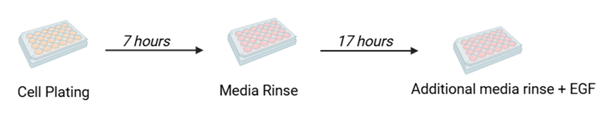
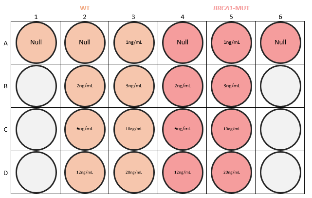
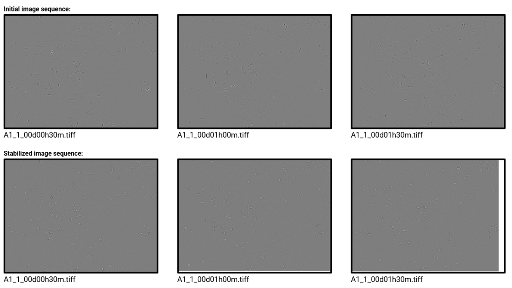
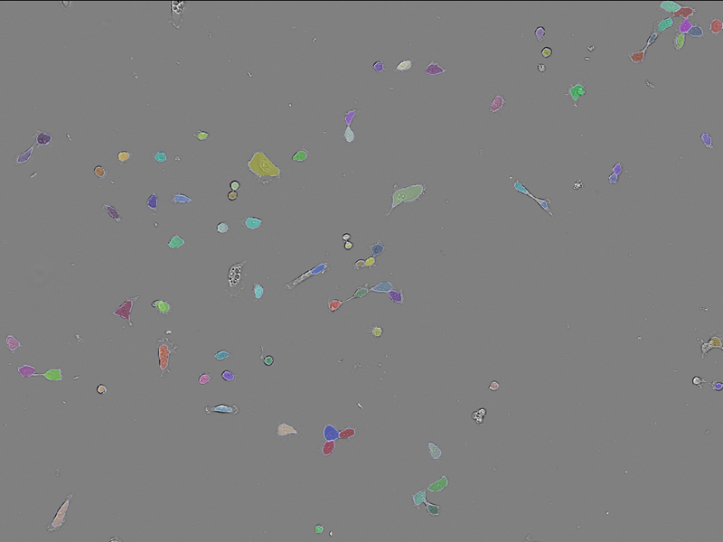
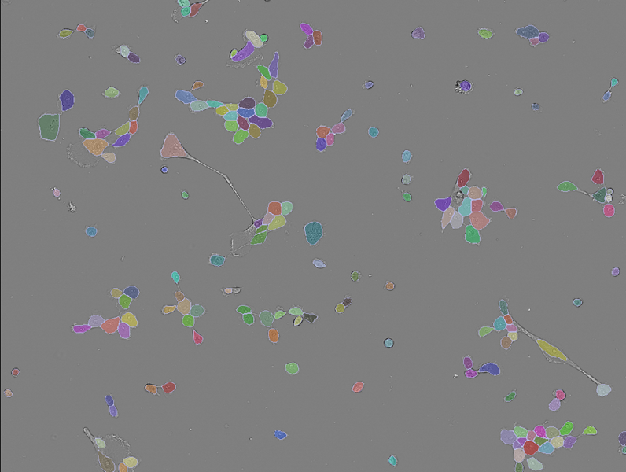

# Project title: Evaluating phenotypic and molecular responses in MCF10A wild type and BRCA1 (185delAG/+) 

## Background
Breast cancers can develop and progress due to the irregularities in their microenvironments and intrinsic dysregulation of epithelial cells. This can disrupt some of the key hallmarks of cancer that include cell proliferation, cell-cell interactions and extracellular signaling[3,4]. The BRCA1 gene mutation accounts for about 40-45% of hereditary breast cancers[5]. BRCA1 is a key participant in cell cycle progression and DNA damage response[7]. However, the role of the BRCA1 mutation in the dysregulation of these epithelial cels in relation to extracellular signaling is not well understood. Our hypothesis states that extracellular signals like ligands and cytokines promote cancer-associated phenotypes in BRCA1-mutant epithelial cells. To understand normal and mutated cellular behavior through extracellular signaling and proliferation rates, three signaling factors were selected because of their abilities to promote or inhibit cell proliferation: epidermal growth factor (EGF), transforming growth factor β (TGFβ) and interferon-γ (IFNγ). Most importantly, EGF is implicated in the development and growth of mammary glands[6], making it one of the most common growth factors in mammary epithelial cells. Hence, MFC10As are known to require EGF to proliferate[2], it was important to test for EGF sensitivity through EGF dose response experiments before conducting ligand combination treatments with a steady dose of EGF. 

## Methods for phenotypic responses
 Figure 1. Experiment plate media rinse flow 

   
  

Cells were seeded at 4000 per well with growth media (DMEM/F12, horse serum, rhEGF, hydrocortisone, cholera toxin and insulin) for 7 hours on a 24 well-plate cross compatible with the IncuCyte S3 and the InCell Analyzer 6000, both provided by the Heiser Lab at Oregon Health and Science University (OHSU). Then, cells were rinsed with experimental media, growth media without rhEGF and insulin, and incubated at 37C for 17 hours. Finally, the following concentrations of EGF were administered: 1ng/mL, 2ng/mL, 3ng/mL, 6ng/mL, 10ng/mL, 12ng/mL and 20ng/mL.

Figure 2. EGF experiment plate map

  
  

# Image Analysis Pipeline for Live-Cell Imaging Data
## 1. Sorting ([raw_sort.py](image_analysis/raw_sort.py))
For personal preference, I organized all of the raw images obtained by the IncuCyte using this script. This sorted all the raw images into their respective folders following by the well plate's letter, well number and region of interest (ROI).

Figure 1. An IncuCyte S3 imaged 36 regions of interest (ROIs) of 16 wells every 30 minutes for 48 hours resulting in 55,872 live-cell images. The labeling image format indicates the well, the ROI and the time interval. So, for the example, the label indicates that the image belongs to the A1 well, it was taken on first ROI and the time interval indicates 4 hours and 30 minutes.

## 2. Stabilizing ([stabilize.ijm](image_analysis/stabilize.ijm))
A [FIJI](https://imagej.net/software/fiji/) macro script uses the [StackReg](https://bigwww.epfl.ch/thevenaz/stackreg/) and [TurboReg](https://bigwww.epfl.ch/thevenaz/turboreg/) plugins register all images like an image sequence and reduce shakiness. It facilitates cell visualization when observation proliferation over time. This is necessary because every image taken at the same ROI, regardless of the interval, will be positioned slightly differently due to the IncuCyte S3’s processing and camera positioning, and it helps the Cellpose model segment more efficiently.

Figure 2. Image sequence A2_1 before stabilizing step.

Figure 3. Image sequence A2_1 after stabilizing step.

Figure 4. A side-by-side image sequence comparison on the first 3 30-minute intervals of the first ROI in the A1 well. The white background indicates how the image was moved to maintain consistency. THe white box is also visible, which the cropping step will find to crop.

## 3. Cropping ([cropping.py](image_analysis/cropping.py))
This python script  crops the white background created when the images were moved in frame to be stabilized. This script can also indicate if an image sequence was stabilized incorrectly due to debris or additional noise, which can interfere with the FIJI plugins.

Figure 5. Image sequence A2_1 after cropping step.

## 4. Quality Control
In this step, depending on where the previous steps failed, image sequences are stabilized and/or cropped manually. This usually occurs with 5-10 ROIs per experiment plate. This can happen if chunks of debri are big enough to disrupt the sequence or if the incorrect plate dimensions were chosen in the IncuCyte before imaging. Otherwise, all the previous steps work just fine.

## 5. Segmentation ([cellpose_segmentation.py](image_analysis/cellpose_segmentation.py))
This python script utilizes a trained [Cellpose](https://www.nature.com/articles/s41592-022-01663-4) model that can easily identify MCF10A cells and create masks for each cell it recognized. This mask provides information on the approximate size and position of a cell in an image using pixels as units. The Heiser lab's MCF10A Cellpose model was developed using pilot data from prior research efforts. Notably, [Gross et al., 2022](https://www.nature.com/articles/s42003-022-03975-9) conducted a multi-omic analysis of MCF10A cells, generating a resource for integrative assessment of ligand-mediated molecular and phenotypic responses, which contributed to the model’s training.

It is crucial to have a trained model for this step. A Cellpose model can be trained with just 500-1000 images of ground truths masks. However, the more images the model is trained with, the more efficiently it generates masks.

Figure 6. Generated masks using Cellpose [GUI].

  

## 6. Counting ([cell_counting.py](image_analysis/cell_counting.py))
Finally, this script counts all the generated masks from an ROI as cells.
#### Masks per ROI output: This gives you cell counts per time interval for each individual ROI. This can be useful for checking how well the Cellpose model is performing by comparing the outputs from this file to ground truths masks.
| Well Name | 0 | 0.5 | ... | 48.0
|-----------|:---:|:---:|:---:|----:|
|A2_1       | 76 | 81 | ... | 854 |
|A2_2       | 89 | 96 | ... | 1084 |

## Sample videos after stabilization and cropping:
[MCF10A WT - No EGF](https://www.youtube.com/watch?v=-XLfIhz3GHA&ab_channel=NataliaQuintanaParrilla)

[MCF10A WT - 10ng/mL](https://www.youtube.com/watch?v=HWFD3kKy6NY&ab_channel=NataliaQuintanaParrilla)

[MCF10A BRCA1+/- No EGF](https://youtu.be/WdU7pWYCmfU)

[MCF10A BRCA1+/- - 10ng/mL](https://youtu.be/3sQ2YhjJNU0)

# Future objectives:
1. Design a python script that can perform the same as the FIJI macro stabilizing script for faster processing.
2. Make the counting step 6a and a new step 6b for motility. This step would require a script that uses the segmentation masks to track the cells' positions in an ROI image and calculates how many pixels per second that each cell is moving. 

# References:
1. Gross, S.M., Dane, M.A., Smith, R.L. et al. A multi-omic analysis of MCF10A cells provides a resource for integrative assessment of ligand-mediated molecular and phenotypic responses. Commun Biol 5, 1066 (2022). https://doi.org/10.1038/s42003-022-03975-9
2. Gupta, A., Hunt, C. R., Chakraborty, S., Pandita, R. K., Yordy, J., Ramnarain, D. B., ... & Pandita, T. K. (2014). Role of 53BP1 in the regulation of DNA double-strand break repair pathway choice. Radiation research, 181(1), 1-8.
3. Hanahan, D. (2022). Hallmarks of Cancer: New Dimensions. Cancer discovery, 12(1), 31-46.
4. Hanahan, D., & Weinberg, R. A. (2011). Hallmarks of Cancer: The Next Generation. Cell, 144(5), 646-674.
5. Pachitariu, M., Stringer, C. Cellpose 2.0: how to train your own model. Nat Methods 19, 1634–1641 (2022). https://doi.org/10.1038/s41592-022-01663-4
6. Wee, P., & Wang, Z. (2017). Epidermal growth factor receptor cell proliferation signaling pathways. Cancers, 9(5), 52.
7. Wu, J., Lu, L. Y., & Yu, X. (2010). The role of BRCA1 in DNA damage response. Protein & cell, 1, 117-123.

